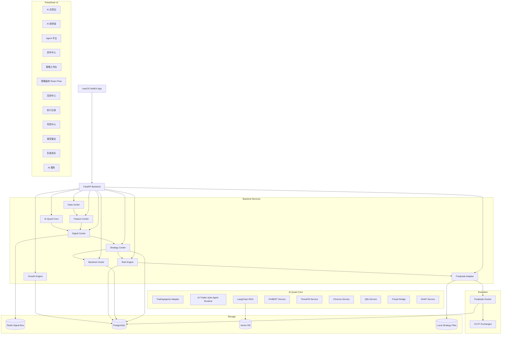

# PulseDesk v2.0 技术方案

## 1. 技术原则

1. **Signal First**：所有 AI、模型、策略、市场、链上、新闻、手动输入都统一输出 Signal。
2. **Execution Isolation**：PulseDesk 不直接对交易所下单，Crypto 执行通过 Freqtrade。
3. **Risk Gate Mandatory**：所有部署前策略、PlannedTradeIntent、live_small 请求必须通过 RiskEngine；Freqtrade 运行中通过硬风控与监控风控兜底。
4. **AI No Direct Trade**：AI/Agent 只能输出 Signal / ResearchReport / StrategyDraft，不允许直接下单、创建 Command 或生成开放式 Strategy.py。
5. **Reproducible Backtest**：策略进入 paper / live 前必须有可复现回测结果。
6. **Audit Everything**：所有 Signal、策略版本、风控决策、执行记录、Agent 输出都必须日志化。
7. **Human-in-the-loop for Live**：live_small 必须人工确认。

## 2. 总体架构



## 3. 后端服务职责

### 3.1 Data Center

职责：

- 拉取行情 OHLCV；
- 拉取资金费率；
- 拉取 Open Interest；
- 拉取爆仓数据；
- 拉取新闻/公告；
- 拉取链上数据；
- 同步 Freqtrade 订单与日志。

模块：

```text
data_center/
├── market_data.py
├── news_data.py
├── onchain_data.py
├── funding_data.py
├── liquidation_data.py
├── order_history.py
└── data_quality.py
```

### 3.2 Feature Center

职责：

- 技术指标；
- 底部横盘特征；
- 滚动低点；
- 插针特征；
- 操控特征；
- 情绪特征；
- Qlib 因子。

模块：

```text
feature_center/
├── technical_features.py
├── bottom_features.py
├── rolling_low_features.py
├── manipulation_features.py
├── sentiment_features.py
└── qlib_features.py
```

### 3.3 AI Quant Core

职责：

- TradingAgents 多 Agent 投研；
- AI-Trader-style Agent Runtime；
- RAG；
- LLM 路由；
- FinBERT；
- TimesFM；
- Chronos；
- Qlib；
- FreqAI；
- SHAP。

模块：

```text
ai_quant_core/
├── tradingagents_adapter.py
├── ai_trader_agent_runtime.py
├── langchain_rag.py
├── llm_router.py
├── finbert_service.py
├── timesfm_service.py
├── chronos_service.py
├── qlib_service.py
├── freqai_bridge.py
├── shap_service.py
└── agent_registry.py
```

### 3.4 Signal Center

职责：

- Signal Schema；
- Signal 发布；
- Signal 聚合；
- Signal 冲突检测；
- Signal 评分；
- Signal 存储；
- Signal 生成 StrategyDraft。

模块：

```text
signal_center/
├── schemas.py
├── publisher.py
├── aggregator.py
├── conflict_detector.py
├── score_engine.py
└── signal_store.py
```

### 3.5 Strategy Center

职责：

- 策略 Schema；
- 策略模板；
- 策略版本；
- 画布 DAG 适配；
- StrategyRuleDSL 校验与 RulePackage 发布；
- config 生成；
- 策略状态机。

模块：

```text
strategy_center/
├── strategy_schema.py
├── strategy_factory.py
├── strategy_templates.py
├── canvas_dag_adapter.py
├── freqtrade_strategy_generator.py
└── strategy_versioning.py
```

### 3.6 Freqtrade Adapter

职责：

- Docker 管理；
- config 生成；
- RulePackage 写入；
- backtest 运行；
- dry-run 管理；
- REST/RPC 客户端；
- WebSocket 事件同步；
- 日志解析。

模块：

```text
freqtrade_adapter/
├── docker_manager.py
├── config_generator.py
├── strategy_file_writer.py
├── backtest_runner.py
├── dry_run_manager.py
├── rpc_client.py
└── log_parser.py
```

### 3.7 Risk Engine

职责：

- 交易前风控；
- 组合风险；
- 相关性风险；
- 操控风险；
- Agent 权限；
- 紧急停止；
- live_small 人工确认。

模块：

```text
risk_engine/
├── pre_trade_risk.py
├── portfolio_risk.py
├── manipulation_risk.py
├── correlation_risk.py
├── agent_permission.py
└── emergency_stop.py
```

### 3.8 Growth Engine

职责：

- 订单分析；
- 盈亏挖掘；
- SHAP 解释；
- 策略优化；
- 候选策略生成；
- 自我进化调度。

模块：

```text
growth_engine/
├── order_analyzer.py
├── win_loss_miner.py
├── shap_explainer.py
├── strategy_optimizer.py
├── candidate_generator.py
└── evolution_scheduler.py
```

## 4. 前端架构

### 4.1 macOS App

```text
macos-app/
├── AppShell/
│   ├── SidebarView.swift
│   ├── TopStatusBar.swift
│   └── AppRouter.swift
├── Dashboard/
│   └── AIQuantDashboardView.swift
├── ResearchRoom/
│   └── ResearchRoomView.swift
├── AgentPlatform/
│   └── AgentPlatformView.swift
├── SignalCenter/
│   └── SignalCenterView.swift
├── StrategyWorkspace/
│   ├── StrategyListView.swift
│   ├── StrategyCreateView.swift
│   └── CanvasWebView.swift
├── Backtest/
│   └── BacktestCenterView.swift
├── Execution/
│   └── ExecutionRecordView.swift
├── RiskCenter/
│   └── RiskCenterView.swift
├── ManipulationRadar/
│   └── ManipulationRadarView.swift
├── Growth/
│   └── GrowthReviewView.swift
└── Settings/
    ├── AIServiceView.swift
    └── SystemSettingsView.swift
```

### 4.2 React Flow 画布

```text
canvas/
├── src/
│   ├── App.tsx
│   ├── Canvas.tsx
│   ├── nodes/
│   │   ├── SignalNode.tsx
│   │   ├── TechnicalNode.tsx
│   │   ├── ConditionNode.tsx
│   │   ├── AggregateNode.tsx
│   │   ├── RiskNode.tsx
│   │   ├── PositionNode.tsx
│   │   ├── ExecutionNode.tsx
│   │   └── NotificationNode.tsx
│   ├── panels/
│   │   ├── NodeLibrary.tsx
│   │   ├── ConfigPanel.tsx
│   │   └── ValidationPanel.tsx
│   ├── bridge/
│   │   └── SwiftBridge.ts
│   ├── schema/
│   │   ├── dag.ts
│   │   └── validateDAG.ts
│   └── store/
│       └── canvasStore.ts
```

## 5. 部署架构

第一阶段本机部署：

```text
macOS App
FastAPI localhost:18080
Redis localhost:6379
PostgreSQL localhost:5432
Freqtrade Docker containers
Vector DB local
Ollama localhost:11434
```

推荐 docker-compose：

```text
services:
  redis
  postgres
  backend
  freqtrade-dryrun-btc
  freqtrade-dryrun-alt
```

注意：macOS 原生 App 通过 localhost API 访问后端，不直接访问数据库和 Docker socket。Docker 管理应由 backend 封装，避免 UI 层直接操作 Docker。

## 6. 强制边界

1. `AI Quant Core` 不允许直接调用 Freqtrade 下单接口。
2. `Signal Center` 不允许产生实盘订单。
3. `Strategy Center` 只能产生 StrategyDraft / StrategyVersion / StrategyRuleDSL / RulePackage。
4. `Risk Engine` 是部署前风控、PlannedTradeIntent 风控和 live_small 门禁模块；Freqtrade 实际订单通过内部硬风控和运行中监控约束。
5. `Freqtrade Adapter` 只执行 RiskEngine 通过的策略和配置。
6. 所有 live 操作必须检测 `emergency_stop == false`。
7. 所有 live 操作必须具备 `human_approved == true`。

---

# v2.1 工程补强章节

## 7. Freqtrade 集成状态机

Freqtrade 集成必须以状态机驱动，避免 UI、后端、Docker、Freqtrade 真实状态不一致。

### 7.1 StrategyVersion 状态机

```text
created
  ↓ validate
validated
  ↓ generate_freqtrade_files
files_generated
  ↓ run_backtest
backtesting
  ↓ backtest_success / backtest_failed
backtested
  ↓ start_dry_run
dry_run_starting
  ↓ heartbeat_ok
dry_running
  ↓ dry_run_passed / dry_run_failed / stop
dry_run_passed
  ↓ human_approve_live
live_pending
  ↓ start_live_small
live_small_running
  ↓ pause / emergency_stop
paused / emergency_stopped
```

### 7.2 FreqtradeRun 状态机

```text
queued
  ↓
config_generated
  ↓
container_starting
  ↓
running
  ↓
degraded
  ↓
stopped / failed / completed
```

### 7.3 PulseDesk 与 Freqtrade 职责边界

| 动作 | PulseDesk 是否触发 | Freqtrade 是否执行 | 说明 |
|---|---:|---:|---|
| 发布策略规则 | 是 | 否 | 只发布 StrategyRuleDSL RulePackage；`PulseDeskUniversalStrategy.py` 是固定模板 |
| 生成 config.json | 是 | 否 | 包含 dry_run、exchange、pairlist、risk config |
| run backtest | 是 | 是 | PulseDesk 调用 Freqtrade CLI / Docker |
| start dry-run | 是 | 是 | PulseDesk 启动 Docker 容器 |
| place order | 否 | 是 | 实际下单由 Freqtrade 执行 |
| sync order | 只读 | 是 | PulseDesk 通过 REST/WebSocket/日志同步 |
| emergency stop | 是 | 是 | PulseDesk 停止容器/暂停策略 |
| edit order | 否 | 是 | 第一阶段不支持 PulseDesk 手动改订单 |

### 7.4 失连降级行为

| 场景 | 行为 |
|---|---|
| Freqtrade REST 不可用 | run 标记 `degraded`，禁止 live_small，继续读取日志 |
| WebSocket 断开 | 自动重连 3 次，仍失败则降级为 REST polling |
| Docker 容器退出 | run 标记 `failed`，写 execution_log，通知 UI |
| 订单同步延迟 > 60s | 风控中心触发 `ORDER_SYNC_DELAY` |
| 配置生成失败 | StrategyVersion 回退到 `validated`，不允许 backtest |
| RulePackage 加载失败 | BacktestRun 标记 `failed`，保留错误日志，并回退 last-known-good package |

## 8. 操控雷达数据来源与可行性

操控雷达分三层实现，避免一开始就依赖昂贵链上数据。

### 8.1 Phase 5A：只用行情可计算特征

数据来源：CCXT / Freqtrade 下载的 OHLCV。

可实现特征：

- 长上影线 / 长下影线比例；
- 单根 K 线振幅异常；
- 成交量 z-score；
- 快速拉升后回落；
- 低流动性高波动；
- 连续插针次数；
- 价格偏离均线后快速回归。

### 8.2 Phase 5B：衍生品特征

数据来源：交易所 API / 第三方数据源。

特征：

- Funding rate 极值；
- Open Interest 突变；
- 多空比极端；
- 爆仓密度；
- 资金费率与价格反向背离。

### 8.3 Phase 5C：链上与钱包集中度

候选来源：

- Etherscan / Solscan API；
- Dune Query API；
- Nansen / Arkham / Glassnode / CryptoQuant 等第三方；
- 自建链上索引服务。

第一阶段不强依赖商业 API，优先支持手动导入 CSV / Dune 查询结果，后续再接 API。

### 8.4 操控评分处理原则

操控雷达不输出“必涨/必跌”，只输出风险：

```text
ManipulationRiskSignal
  ↓
RiskEngine
  ↓
ALLOW / REDUCE_SIZE / PAPER_ONLY / REJECT
```

## 9. AI 服务管理与 Provider 路由

所有 AI 调用必须经过 `LLMRouter` 或专用模型服务，禁止页面直接调用 LLM Provider。

### 9.1 路由配置

```yaml
routes:
  research_deep:
    primary: openai:gpt-4.1
    fallback: deepseek:deepseek-chat
    local_fallback: ollama:qwen2.5:14b
    max_latency_ms: 60000
  research_fast:
    primary: deepseek:deepseek-chat
    fallback: ollama:qwen2.5:14b
    max_latency_ms: 20000
  rag_summary:
    primary: ollama:qwen2.5:14b
    fallback: deepseek:deepseek-chat
  sentiment:
    primary: local:finbert
    fallback: deepseek:deepseek-chat
  prediction:
    primary: local:timesfm
    fallback: local:chronos
  attribution:
    primary: local:shap
```

### 9.2 Provider 切换影响

- 已生成 Signal 不被重算；
- 新 Signal 记录 provider/model/prompt 版本；
- 当云模型不可用时，Agent 权限自动降级到 `signal_only`；
- 当预测模型不可用时，PredictionSignal 模块禁用，不允许返回空预测；
- 当本地模型延迟超阈值时，UI 显示 `degraded`。

## 10. 关键技术依赖与风险

| 依赖 | 风险 | 处理方式 |
|---|---|---|
| Freqtrade 版本 | 策略接口或配置字段变化 | 锁定 Docker tag，升级前跑回归测试 |
| CCXT 交易所支持 | 不同交易所字段/限频差异 | 第一阶段只支持 Binance/OKX dry-run，封装 ExchangeCapability |
| Docker | macOS 权限和 socket 风险 | UI 不直接操作 Docker，由 backend 代理 |
| Freqtrade REST/WebSocket | 失连导致状态不一致 | 心跳、重连、降级 polling、状态机 |
| LLM Provider | 延迟/费用/不可用 | LLMRouter、超时、fallback、权限降级 |
| LangChain/LangGraph | 工具调用和文件权限风险 | sandbox、禁用危险反序列化、工具白名单 |
| 链上数据 API | 费用高、覆盖不全、延迟 | Phase 5 支持 CSV/Dune 手动导入，后接 API |
| FreqAI/TimesFM/Chronos | 预测不稳定或过拟合 | 输出 Signal，不直接交易；必须回测/dry-run |
| SHAP | 解释成本高、特征漂移 | 只在复盘任务运行，记录 feature schema version |


---

## 13. v2.2 工程化重构：Inference Queue / Strategy DSL / MCP / 双层风控

### 13.1 Inference Worker Queue

PulseDesk 不允许多个本地大模型任务无序并发。所有本地 heavyweight 推理任务必须进入 `Inference Worker Queue`。

新增模块：

```text
ai_quant_core/
├── inference_queue.py
├── vram_scheduler.py
├── model_runtime_state.py
├── job_store.py
└── provider_adapters/
```

调度原则：

1. Freqtrade 状态同步、RiskEngine、Emergency Stop 不进入 AI 推理队列。
2. Ollama LLM、TradingAgents、TimesFM、Chronos、SHAP 批量解释默认 GPU 串行。
3. FinBERT 可以按配置小并发。
4. 任务必须有 timeout、cancel、degraded 输出。
5. 本地模型 OOM 不允许导致 FastAPI 主进程崩溃。

### 13.2 StrategyRuleDSL + PulseDeskUniversalStrategy

Freqtrade 策略生成方式调整为：

```text
AI / Canvas / Signal
  ↓
StrategyDraft
  ↓
StrategyRuleDSL(JSON)
  ↓
DSL Validator
  ↓
PulseDeskUniversalStrategy.py 固定模板读取规则
  ↓
Freqtrade backtest / dry-run / live_small
```

强制约束：

- LLM 不允许直接写 `.py` 策略文件；
- 画布不允许输出 Python；
- Strategy Center 只输出 JSON DSL；
- Freqtrade 侧只加载固定策略模板；
- Python 策略模板必须版本锁定、单元测试、CI 校验。

### 13.3 Signal 存储治理

Signal Center 主表必须支持高频写入治理：

- PostgreSQL `signals` 按月 RANGE 分区；
- Redis 只保留 latest / active index；
- 大文本 reasoning/evidence 单独存储；
- expired 低分 Signal 14 天后迁移冷存档；
- Signal Center 默认查询最近 7 天，不允许无条件全表扫描。

### 13.4 PulseDesk MCP Server

新增本地 MCP Server，默认只读，用于外部 AI 客户端读取 PulseDesk 状态：

```text
mcp_server/
├── server.py
├── tools_signals.py
├── tools_freqtrade.py
├── tools_risk.py
├── tools_growth.py
└── audit.py
```

MCP v1 只开放：

- 查询最新 Signal；
- 查询 Freqtrade 状态；
- 查询持仓订单；
- 查询风控事件；
- 查询操控雷达评分；
- 查询回测报告；
- 查询复盘报告。

MCP v1 禁止：

- 启动 live；
- 下单；
- 关闭风控；
- 更新交易所 API Key；
- 执行 shell；
- 写 Python 策略文件。

### 13.5 Freqtrade 双层风控兜底

PulseDesk RiskEngine 不能成为唯一止损来源。每个可运行 Freqtrade 策略都必须在 Freqtrade 原生配置里写入硬风控。

最低要求：

```text
stoploss 必须存在
max_open_trades 必须存在
trailing_stop 按策略风险等级配置
live_small 不允许 stoploss = 0
高风险猎币不允许 unlimited max_open_trades
```

失连状态：

```text
healthy → connection_lost → pulse_degraded → freqtrade_native_guard_only → reconciliating → healthy
```

当 PulseDesk 与 Freqtrade 失连且存在持仓时，UI 必须显示 `freqtrade_native_guard_only`，并禁止策略升级、新开 live_small、提高仓位。

---

# v2.3 Addendum — Cloud / Hybrid AI Routing

## 1. 结论

PulseDesk 的 AI Quant Core 不应默认本地全量运行。v2.3 改为：

```text
Cloud LLM Provider 优先
Remote Dedicated Model Provider 次之
Local Model Provider 兜底
```

本地设备负责控制流、风控、Freqtrade 管理、数据持久化；重资产 AI 推理尽量交给云端或远程专用模型服务。

## 2. 更新后的 AI Quant Core

```text
ai_quant_core/
├── llm_router.py
├── provider_policy.py
├── privacy_redactor.py
├── structured_output_validator.py
├── provider_trace.py
├── inference_queue.py
├── providers/
│   ├── base.py
│   ├── openai_provider.py
│   ├── anthropic_provider.py
│   ├── deepseek_provider.py
│   ├── ollama_provider.py
│   ├── replicate_provider.py
│   ├── runpod_provider.py
│   └── private_model_server_provider.py
├── tradingagents_adapter.py
├── langchain_rag.py
├── sentiment_llm_service.py
├── timesfm_remote_service.py
├── chronos_remote_service.py
└── shap_job_service.py
```

## 3. LLMRouter Routing Policy

```json
{
  "task_type": "research_deep_dive",
  "privacy_level": "medium",
  "latency_class": "slow_ok",
  "quality_level": "high",
  "structured_output_required": true,
  "max_cost_usd": 1.5,
  "fallback_chain": ["deepseek", "anthropic", "openai", "ollama"]
}
```

## 4. Provider 任务映射

| 任务 | 默认方式 | 兜底 |
|---|---|---|
| AI 投研室 | 云端 LLM | 本地 Ollama degraded |
| RAG 摘要 | 云端轻量 LLM | 本地 Ollama |
| Agent 辩论 | 云端低成本 LLM | 本地 Ollama |
| 情绪分析 | 云端 LLM structured output | 本地 FinBERT |
| StrategyDraft | 云端 structured output | 禁止自动执行 |
| TimesFM / Chronos | RemoteModelProvider | LocalGPUQueue 夜间批处理 |
| SHAP | RemoteModelProvider / offline batch | LocalBatchQueue |

## 5. Provider Trace

所有 AI 生成对象必须记录：

```json
{
  "provider_trace": {
    "provider": "deepseek",
    "model": "example-model",
    "request_id": "provider_req_xxx",
    "input_hash": "sha256:...",
    "schema_version": "signal_v2_3",
    "latency_ms": 3200,
    "estimated_cost_usd": 0.02,
    "created_at": "..."
  }
}
```

## 6. Privacy Redaction

云端请求必须经过 `PrivacyRedactor`：

```text
API Key / Secret / Token：禁止发送
原始订单明细：默认不发送，只允许发送统计摘要
钱包地址簿：默认不发送，除非人工确认
本地路径：脱敏
账户标识：脱敏
```

## 7. 交易安全规则

1. live_small 不得依赖实时 LLM 响应；
2. AI Provider degraded 只影响 Signal 生成，不影响 Freqtrade 原生硬风控；
3. 云端 LLM 不得生成开放式 Strategy.py；
4. 云端输出必须 JSON Schema + Pydantic validate；
5. Provider 切换只影响新 Signal，不得篡改历史 Signal。

完整设计见：`08_Cloud_Hybrid_AI_Routing_v2_3.md`。


---

# v2.3.2 Engineering Hardening Updates

## UniversalStrategy Rule Cache

`PulseDeskUniversalStrategy.py` must read `StrategyRuleDSL` through a last-known-good in-memory cache. Hot-path strategy callbacks must not repeatedly perform full JSON file reads. Rule reload must be gated by file mtime/hash/version and happen at low-frequency lifecycle points such as `bot_loop_start()`.

## Data Federation Layer

Signal lookup must be implemented as a repository layer spanning Redis latest cache, PostgreSQL hot partitions, SQLite cold archive, and Parquet cold archive. `trade_intents.source_signal_ids` is not sufficient for evidence recovery unless all lookups go through `SignalRepository`.

## Reconciliation Lock

`reconciliating` is a blocking state. PulseDesk must stop outbound TradeIntent and strategy deployment until current Freqtrade state has overwritten local stale state.

## v2.4 架构审计补丁：底层解耦与执行契约

### 1. 对象语义分层

系统不得把所有数据都写成 Signal。v2.4 明确对象分层：

```text
RawData     原始行情、新闻、链上、交易所事件
Feature     技术指标、情绪分、资金费率、钱包集中度、操控特征
Insight     解释性发现
Signal      可进入策略判断的交易信号
TradeIntent 可进入风控的交易意图
RiskDecision 风控决策
ExecutionEvent 不可变执行事件
```

Signal Center 只管理 Signal；Feature Center 管理 Feature；Execution Ledger 管理 ExecutionEvent。

### 2. StrategyRuleDSL 作为唯一执行契约

所有策略来源必须编译为 StrategyRuleDSL：

```text
AI / RAG / Manual / Canvas / Growth Candidate
  ↓
StrategyDraft
  ↓
StrategyRuleDSL(JSON)
  ↓
DSL Validator
  ↓
PulseDeskUniversalStrategy.py
  ↓
Freqtrade
```

禁止任何模块动态生成开放式 `Strategy.py`。

### 3. Command Bus

所有 Freqtrade 写操作必须通过 Command Bus，包括：

```text
DeployRulesCommand
StartBacktestCommand
StartDryRunCommand
StopDryRunCommand
RequestLiveSmallCommand
EmergencyStopCommand
```

UI、AI、Canvas 不得直接调用 Docker 或 Freqtrade 写 API。

### 4. Execution Ledger

所有执行事件必须 append 到 `execution_ledger_events`，包括 Freqtrade WebSocket、REST polling、RiskDecision、Reconciliation 事件。该表是断线恢复和 Growth Engine 的事实源。

### 5. 模块边界

详细边界见 `11_Module_Boundaries_v2_4.md`。核心规则：

```text
Signal Center 不创建 TradeIntent；Strategy Center 不创建 Command；AI 不创建 Command。
Strategy Center 不操作 Docker。
Freqtrade Adapter 不做交易权限判断。
Risk Engine 不操作容器。
AI Quant Core 不写 StrategyVersion。
Growth Engine 不自动替换 live 策略。
```


---

## v2.5 收口说明

本文件中若仍存在与 `00_MASTER_ARCHITECTURE_DECISION_v2_5.md` 冲突的旧描述，以 v2.5 Master Architecture Decision 为准。特别是：禁止开放式 Strategy.py 生成；禁止 Canvas 生成 Python；Freqtrade 只加载固定 `PulseDeskUniversalStrategy.py` 并读取 StrategyRuleDSL RulePackage。
