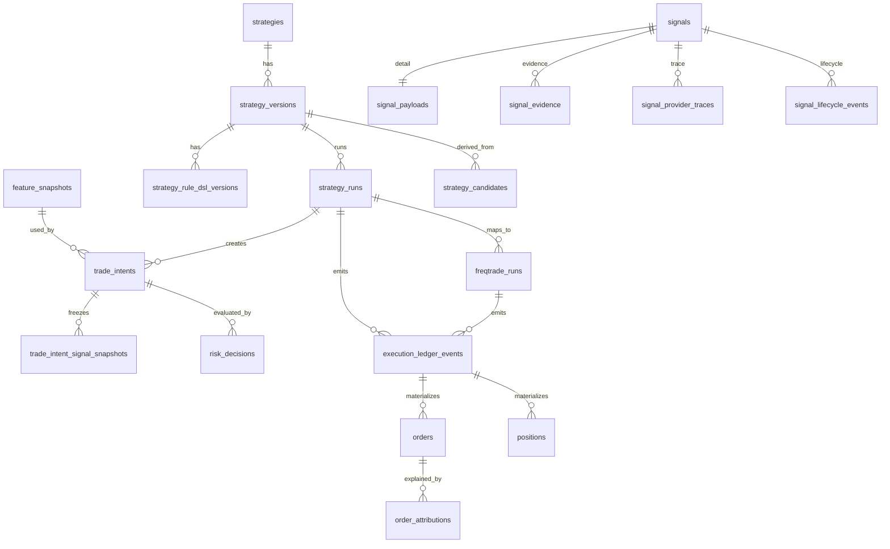

# PulseDesk v2.4 数据库 ERD 与表结构设计

> 目标：把 PulseDesk 的核心数据模型从“功能表集合”升级为可扩展、可审计、可归因、可恢复的交易系统数据库契约。

## 1. 设计原则

### 1.1 核心原则

```text
1. Signal 轻量索引，大文本拆表。
2. 策略身份、策略版本、策略运行实例分离。
3. TradeIntent 创建时必须固化触发快照。
4. FeatureSnapshot 是订单学习与 SHAP 归因的基础。
5. ExecutionLedger 是不可变执行事实源。
6. FreqtradeRun 与 StrategyRun 分离。
7. 热数据在 PostgreSQL，冷数据可进入 SQLite / Parquet，但必须统一查询。
8. 上层模块禁止绕过 Repository 直接查表。
```

### 1.2 数据对象分层

```text
RawData
  原始行情、新闻、链上、订单簿、Freqtrade 事件。

Feature
  RSI、MACD、价格分位、资金费率、OI、钱包集中度、操控特征等。

Insight
  解释性发现，例如“资金费率异常偏高”“新闻叙事转正”。

Signal
  可进入策略判断的交易信号，例如“BTC 1h long, confidence=0.72, expires_at=...”。

TradeIntent
  策略生成的交易意图，例如“买入 BTC 3% 仓位”。

RiskDecision
  风控引擎对 TradeIntent 的决策。

ExecutionEvent
  Freqtrade / PulseDesk / Exchange 的不可变执行事件。
```

---

## 2. 核心 ERD



---

## 3. Signal 表设计

### 3.1 signals：轻量索引表

`signals` 只保存列表页、筛选、排序、生命周期判断所需字段。不要存大段 reasoning、raw_output。

```sql
CREATE TABLE signals (
    id UUID PRIMARY KEY,
    source_type TEXT NOT NULL,
    source_id UUID,
    source_name TEXT,

    symbol TEXT NOT NULL,
    market TEXT NOT NULL DEFAULT 'crypto',
    timeframe TEXT,

    direction TEXT NOT NULL CHECK (direction IN ('long','short','hold','risk','block','neutral')),
    confidence NUMERIC(6,4) CHECK (confidence >= 0 AND confidence <= 1),
    score NUMERIC(8,4),
    risk_level TEXT CHECK (risk_level IN ('low','medium','high','extreme')),

    status TEXT NOT NULL CHECK (status IN ('pending','active','expired','rejected','executed','archived','degraded')),
    permission JSONB NOT NULL DEFAULT '{}'::jsonb,

    valid_from TIMESTAMPTZ NOT NULL,
    expires_at TIMESTAMPTZ,
    created_at TIMESTAMPTZ NOT NULL DEFAULT now(),
    updated_at TIMESTAMPTZ NOT NULL DEFAULT now()
) PARTITION BY RANGE (created_at);
```

### 3.2 signal_payloads：大文本与结构化输出

```sql
CREATE TABLE signal_payloads (
    signal_id UUID PRIMARY KEY,
    reasoning TEXT,
    structured_output JSONB,
    raw_output JSONB,
    trigger_condition JSONB,
    current_state JSONB,
    evidence_summary TEXT,
    created_at TIMESTAMPTZ NOT NULL DEFAULT now()
);
```

### 3.3 signal_evidence：证据明细

```sql
CREATE TABLE signal_evidence (
    id UUID PRIMARY KEY,
    signal_id UUID NOT NULL,
    evidence_type TEXT NOT NULL,
    evidence_ref TEXT,
    evidence_payload JSONB,
    source_uri TEXT,
    quality_score NUMERIC(6,4),
    created_at TIMESTAMPTZ NOT NULL DEFAULT now()
);
```

### 3.4 signal_provider_traces：AI Provider 审计

```sql
CREATE TABLE signal_provider_traces (
    id UUID PRIMARY KEY,
    signal_id UUID NOT NULL,
    provider TEXT NOT NULL,
    model TEXT NOT NULL,
    task_type TEXT,
    privacy_level TEXT,
    latency_ms INTEGER,
    estimated_cost_usd NUMERIC(12,6),
    input_hash TEXT,
    output_hash TEXT,
    status TEXT NOT NULL,
    error_message TEXT,
    created_at TIMESTAMPTZ NOT NULL DEFAULT now()
);
```

### 3.5 signal_lifecycle_events：生命周期事件

```sql
CREATE TABLE signal_lifecycle_events (
    id UUID PRIMARY KEY,
    signal_id UUID NOT NULL,
    event_type TEXT NOT NULL,
    from_status TEXT,
    to_status TEXT,
    reason TEXT,
    actor TEXT,
    created_at TIMESTAMPTZ NOT NULL DEFAULT now()
);
```

### 3.6 signal_snapshots：归档前不可变快照

被 TradeIntent、订单、策略候选引用过的 Signal，在冷归档前必须保存 snapshot。

```sql
CREATE TABLE signal_snapshots (
    id UUID PRIMARY KEY,
    signal_id UUID NOT NULL,
    snapshot_reason TEXT NOT NULL,
    snapshot_payload JSONB NOT NULL,
    created_at TIMESTAMPTZ NOT NULL DEFAULT now()
);
```

---

## 4. Strategy / DSL 表设计

### 4.1 strategies：策略身份

```sql
CREATE TABLE strategies (
    id UUID PRIMARY KEY,
    name TEXT NOT NULL,
    description TEXT,
    strategy_type TEXT NOT NULL,
    source_type TEXT NOT NULL,
    status TEXT NOT NULL CHECK (status IN ('draft','active','paused','archived','rejected')),
    created_at TIMESTAMPTZ DEFAULT now(),
    updated_at TIMESTAMPTZ DEFAULT now()
);
```

### 4.2 strategy_versions：策略版本

```sql
CREATE TABLE strategy_versions (
    id UUID PRIMARY KEY,
    strategy_id UUID NOT NULL,
    version_no INTEGER NOT NULL,
    status TEXT NOT NULL CHECK (status IN (
        'draft','validated','backtested','paper_running','paper_passed',
        'live_pending','live_small','paused','archived','rejected'
    )),
    dsl_version TEXT NOT NULL,
    rule_dsl JSONB NOT NULL,
    dsl_hash TEXT NOT NULL,
    created_by TEXT NOT NULL,
    created_at TIMESTAMPTZ DEFAULT now(),
    UNIQUE(strategy_id, version_no)
);
```

### 4.3 strategy_rule_dsl_versions：DSL 版本与迁移

```sql
CREATE TABLE strategy_rule_dsl_versions (
    id UUID PRIMARY KEY,
    strategy_version_id UUID NOT NULL,
    dsl_version TEXT NOT NULL,
    rule_dsl JSONB NOT NULL,
    dsl_hash TEXT NOT NULL,
    migration_from TEXT,
    validation_result JSONB,
    created_at TIMESTAMPTZ DEFAULT now()
);
```

---

## 5. StrategyRun / FreqtradeRun

### 5.1 strategy_runs

PulseDesk 层运行实例。

```sql
CREATE TABLE strategy_runs (
    id UUID PRIMARY KEY,
    strategy_version_id UUID NOT NULL,
    mode TEXT NOT NULL CHECK (mode IN ('backtest','dry_run','shadow','live_small')),
    status TEXT NOT NULL CHECK (status IN (
        'created','starting','running','stopping','stopped','failed',
        'degraded','reconciliating','manual_review_required'
    )),
    started_at TIMESTAMPTZ,
    stopped_at TIMESTAMPTZ,
    created_at TIMESTAMPTZ DEFAULT now()
);
```

### 5.2 freqtrade_runs

Freqtrade 容器 / 进程运行实例。

```sql
CREATE TABLE freqtrade_runs (
    id UUID PRIMARY KEY,
    strategy_run_id UUID NOT NULL,
    container_id TEXT,
    config_path TEXT NOT NULL,
    rules_path TEXT NOT NULL,
    ft_db_url TEXT,
    status TEXT NOT NULL,
    last_heartbeat_at TIMESTAMPTZ,
    last_reconciled_at TIMESTAMPTZ,
    api_base_url TEXT,
    websocket_url TEXT,
    created_at TIMESTAMPTZ DEFAULT now()
);
```

---

## 6. TradeIntent / Snapshot / RiskDecision

### 6.1 trade_intents

```sql
CREATE TABLE trade_intents (
    id UUID PRIMARY KEY,
    strategy_run_id UUID NOT NULL,
    strategy_version_id UUID NOT NULL,
    feature_snapshot_id UUID,
    symbol TEXT NOT NULL,
    side TEXT NOT NULL CHECK (side IN ('buy','sell','close','reduce')),
    requested_position_pct NUMERIC(8,4),
    mode TEXT NOT NULL CHECK (mode IN ('backtest','dry_run','shadow','live_small')),
    status TEXT NOT NULL CHECK (status IN ('created','risk_evaluated','rejected','approved','sent','cancelled','executed')),
    reasoning TEXT,
    created_at TIMESTAMPTZ DEFAULT now()
);
```

### 6.2 trade_intent_signal_snapshots

```sql
CREATE TABLE trade_intent_signal_snapshots (
    id UUID PRIMARY KEY,
    trade_intent_id UUID NOT NULL,
    signal_id UUID NOT NULL,
    signal_status_at_trigger TEXT,
    direction TEXT,
    confidence NUMERIC(6,4),
    score NUMERIC(8,4),
    reasoning_snapshot TEXT,
    evidence_snapshot JSONB,
    provider_trace_snapshot JSONB,
    created_at TIMESTAMPTZ NOT NULL DEFAULT now()
);
```

### 6.3 risk_decisions

```sql
CREATE TABLE risk_decisions (
    id UUID PRIMARY KEY,
    trade_intent_id UUID NOT NULL,
    decision TEXT NOT NULL CHECK (decision IN ('ALLOW','REDUCE_SIZE','REJECT','PAPER_ONLY','HUMAN_CONFIRM')),
    final_position_pct NUMERIC(8,4),
    risk_checks JSONB NOT NULL,
    risk_codes TEXT[],
    reasoning TEXT,
    created_at TIMESTAMPTZ DEFAULT now()
);
```

---

## 7. FeatureSnapshot

```sql
CREATE TABLE feature_snapshots (
    id UUID PRIMARY KEY,
    symbol TEXT NOT NULL,
    market TEXT NOT NULL DEFAULT 'crypto',
    timeframe TEXT,
    snapshot_at TIMESTAMPTZ NOT NULL,
    feature_version TEXT NOT NULL,
    technical_features JSONB,
    sentiment_features JSONB,
    onchain_features JSONB,
    manipulation_features JSONB,
    portfolio_features JSONB,
    data_quality JSONB,
    created_at TIMESTAMPTZ NOT NULL DEFAULT now()
) PARTITION BY RANGE (snapshot_at);
```

---

## 8. Execution Ledger

不可变执行账本。禁止业务代码 update 历史事件，只允许 append。

```sql
CREATE TABLE execution_ledger_events (
    id UUID PRIMARY KEY,
    event_type TEXT NOT NULL,
    source_system TEXT NOT NULL,
    source_event_id TEXT,
    strategy_run_id UUID,
    freqtrade_run_id UUID,
    symbol TEXT,
    payload JSONB NOT NULL,
    event_time TIMESTAMPTZ NOT NULL,
    ingested_at TIMESTAMPTZ DEFAULT now()
) PARTITION BY RANGE (event_time);
```

推荐事件类型：

```text
FREQTRADE_ORDER_OPENED
FREQTRADE_ORDER_FILLED
FREQTRADE_TRADE_CLOSED
FREQTRADE_STOPLOSS_TRIGGERED
PULSEDESK_TRADE_INTENT_CREATED
PULSEDESK_RISK_DECISION_CREATED
PULSEDESK_RECONCILIATION_STARTED
PULSEDESK_RECONCILIATION_COMPLETED
PULSEDESK_MANUAL_REVIEW_REQUIRED
```

---

## 9. 冷热数据与查询路径

### 9.1 热库

PostgreSQL 保存：

```text
最近 30-90 天 signals
所有 active / pending / executed signals
所有策略、运行、风控、订单、执行账本
所有被引用的 signal snapshots
```

### 9.2 冷库

SQLite / Parquet 保存：

```text
expired 且未被引用的低价值 signals
历史 payload / evidence
历史 feature snapshots
历史 execution ledger 分区备份
```

### 9.3 统一查询层

```python
class SignalRepository:
    def get_signal(self, signal_id: UUID) -> SignalView: ...
    def get_signals(self, signal_ids: list[UUID]) -> list[SignalView]: ...
    def get_payload(self, signal_id: UUID) -> SignalPayload: ...
    def get_evidence(self, signal_id: UUID) -> list[SignalEvidence]: ...
```

查询顺序：

```text
Redis latest cache
  ↓
PostgreSQL hot partitions
  ↓
signal_snapshots
  ↓
SQLite cold archive
  ↓
Parquet cold archive index
  ↓
tombstone record
```

---

## 10. 索引建议

```sql
CREATE INDEX idx_signals_symbol_status_created
ON signals (symbol, status, created_at DESC);

CREATE INDEX idx_signals_source_created
ON signals (source_type, created_at DESC);

CREATE INDEX idx_signal_traces_signal
ON signal_provider_traces (signal_id);

CREATE INDEX idx_strategy_versions_strategy
ON strategy_versions (strategy_id, version_no DESC);

CREATE INDEX idx_trade_intents_strategy_run
ON trade_intents (strategy_run_id, created_at DESC);

CREATE INDEX idx_feature_snapshots_symbol_time
ON feature_snapshots (symbol, snapshot_at DESC);

CREATE INDEX idx_ledger_strategy_time
ON execution_ledger_events (strategy_run_id, event_time DESC);
```

---

## 11. 数据库开发约束

```text
1. UI 不允许直接写数据库。
2. AI Quant Core 不允许直接写 strategy_versions，只能产出 StrategyDraft。
3. Signal Center 只能通过 SignalRepository 访问 Signal。
4. Growth Engine 禁止直接 join signals 热表，必须使用 Repository。
5. Execution Ledger 只能 append，禁止 update/delete。
6. 任何归档任务执行前必须检查 Signal 是否被 TradeIntent / Order / StrategyCandidate 引用。
7. 任何 live_small 运行必须存在 StrategyVersion、StrategyRun、FreqtradeRun 三层记录。
```
