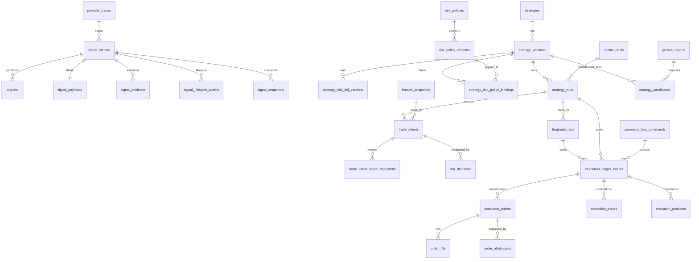

# PulseDesk v2.5 数据库 ERD 与表结构设计

> 本文件替代 `10_Database_ERD_v2_4.md` 作为实现依据。v2.4 文件保留用于历史追溯。

## 1. 设计原则

```text
1. Signal 轻量索引，大文本拆表。
2. 分区表主键必须包含分区键，跨表引用通过 identity 表或 snapshot 表解决。
3. 策略身份、策略版本、策略运行实例分离。
4. TradeIntent 创建时必须固化触发快照。
5. RiskPolicy 必须版本化。
6. FeatureSnapshot 是订单学习与 SHAP 归因基础。
7. ExecutionLedger 是不可变执行事实源。
8. FreqtradeRun 与 StrategyRun 分离。
9. orders / trades / positions 是 materialized view，不是事实源。
10. 上层模块禁止绕过 Repository 直接查冷热分层表。
```

## 2. 核心 ERD



## 3. Signal Identity + 分区表

### 3.1 signal_identity

跨表引用统一引用该表，避免 PostgreSQL 分区表主键 / FK 限制导致实现复杂。

```sql
CREATE TABLE signal_identity (
    id UUID PRIMARY KEY,
    created_at TIMESTAMPTZ NOT NULL DEFAULT now()
);
```

### 3.2 signals

```sql
CREATE TABLE signals (
    id UUID NOT NULL,
    created_at TIMESTAMPTZ NOT NULL DEFAULT now(),

    source_type TEXT NOT NULL,
    source_id UUID,
    source_name TEXT,

    symbol TEXT NOT NULL,
    market TEXT NOT NULL DEFAULT 'crypto',
    timeframe TEXT,

    direction TEXT NOT NULL CHECK (direction IN ('long','short','hold','risk','block','neutral')),
    confidence NUMERIC(6,4) CHECK (confidence >= 0 AND confidence <= 1),
    score NUMERIC(8,4),
    risk_level TEXT CHECK (risk_level IN ('low','medium','high','extreme')),

    status TEXT NOT NULL CHECK (status IN ('pending','active','expired','rejected','executed','archived','degraded')),
    permission JSONB NOT NULL DEFAULT '{}'::jsonb,

    valid_from TIMESTAMPTZ NOT NULL,
    expires_at TIMESTAMPTZ,
    updated_at TIMESTAMPTZ NOT NULL DEFAULT now(),

    PRIMARY KEY (id, created_at)
) PARTITION BY RANGE (created_at);
```

业务表引用 `signal_identity(id)`，不要直接 FK 到 `signals(id, created_at)`。

### 3.3 signal_payloads

```sql
CREATE TABLE signal_payloads (
    signal_id UUID PRIMARY KEY REFERENCES signal_identity(id),
    reasoning TEXT,
    structured_output JSONB,
    raw_output JSONB,
    trigger_condition JSONB,
    current_state JSONB,
    evidence_summary TEXT,
    created_at TIMESTAMPTZ NOT NULL DEFAULT now()
);
```

### 3.4 signal_evidence

```sql
CREATE TABLE signal_evidence (
    id UUID PRIMARY KEY,
    signal_id UUID NOT NULL REFERENCES signal_identity(id),
    evidence_type TEXT NOT NULL,
    evidence_ref TEXT,
    evidence_payload JSONB,
    source_uri TEXT,
    quality_score NUMERIC(6,4),
    created_at TIMESTAMPTZ NOT NULL DEFAULT now()
);
```

### 3.5 signal_lifecycle_events

```sql
CREATE TABLE signal_lifecycle_events (
    id UUID PRIMARY KEY,
    signal_id UUID NOT NULL REFERENCES signal_identity(id),
    event_type TEXT NOT NULL,
    from_status TEXT,
    to_status TEXT,
    reason TEXT,
    actor TEXT,
    created_at TIMESTAMPTZ NOT NULL DEFAULT now()
);
```

### 3.6 signal_snapshots

```sql
CREATE TABLE signal_snapshots (
    id UUID PRIMARY KEY,
    signal_id UUID NOT NULL REFERENCES signal_identity(id),
    snapshot_reason TEXT NOT NULL,
    snapshot_payload JSONB NOT NULL,
    created_at TIMESTAMPTZ NOT NULL DEFAULT now()
);
```

## 4. Provider Trace 通用表

```sql
CREATE TABLE provider_traces (
    id UUID PRIMARY KEY,
    object_type TEXT NOT NULL CHECK (object_type IN (
        'signal','research_report','strategy_draft','strategy_version','growth_report'
    )),
    object_id UUID NOT NULL,
    provider TEXT NOT NULL,
    model TEXT NOT NULL,
    model_version TEXT,
    prompt_version TEXT,
    task_type TEXT,
    privacy_level TEXT,
    latency_ms INTEGER,
    estimated_cost_usd NUMERIC(12,6),
    input_hash TEXT,
    output_hash TEXT,
    status TEXT NOT NULL,
    error_message TEXT,
    created_at TIMESTAMPTZ NOT NULL DEFAULT now()
);
```

## 5. Strategy / DSL

```sql
CREATE TABLE strategies (
    id UUID PRIMARY KEY,
    name TEXT NOT NULL,
    description TEXT,
    strategy_type TEXT NOT NULL,
    source_type TEXT NOT NULL,
    status TEXT NOT NULL CHECK (status IN ('draft','active','paused','archived','rejected')),
    created_at TIMESTAMPTZ DEFAULT now(),
    updated_at TIMESTAMPTZ DEFAULT now()
);

CREATE TABLE strategy_versions (
    id UUID PRIMARY KEY,
    strategy_id UUID NOT NULL REFERENCES strategies(id),
    version_no INTEGER NOT NULL,
    status TEXT NOT NULL CHECK (status IN (
        'draft','validated','backtested','paper_running','paper_passed',
        'live_pending','live_small','paused','archived','rejected'
    )),
    dsl_version TEXT NOT NULL,
    rule_dsl JSONB NOT NULL,
    dsl_hash TEXT NOT NULL,
    created_by TEXT NOT NULL,
    created_at TIMESTAMPTZ DEFAULT now(),
    UNIQUE(strategy_id, version_no)
);

CREATE TABLE strategy_rule_dsl_versions (
    id UUID PRIMARY KEY,
    strategy_version_id UUID NOT NULL REFERENCES strategy_versions(id),
    dsl_version TEXT NOT NULL,
    rule_dsl JSONB NOT NULL,
    dsl_hash TEXT NOT NULL,
    migration_from TEXT,
    validation_result JSONB,
    validator_version TEXT NOT NULL DEFAULT '2.5',
    created_at TIMESTAMPTZ DEFAULT now()
);
```

## 6. RiskPolicy / CapitalPool

```sql
CREATE TABLE risk_policies (
    id UUID PRIMARY KEY,
    name TEXT NOT NULL,
    description TEXT,
    policy_type TEXT NOT NULL CHECK (policy_type IN ('conservative','balanced','high_risk_hunt','live_small','custom')),
    status TEXT NOT NULL CHECK (status IN ('draft','active','archived')),
    created_at TIMESTAMPTZ DEFAULT now(),
    updated_at TIMESTAMPTZ DEFAULT now()
);

CREATE TABLE risk_policy_versions (
    id UUID PRIMARY KEY,
    risk_policy_id UUID NOT NULL REFERENCES risk_policies(id),
    version_no INTEGER NOT NULL,
    policy_json JSONB NOT NULL,
    policy_hash TEXT NOT NULL,
    status TEXT NOT NULL CHECK (status IN ('draft','active','archived')),
    created_by TEXT NOT NULL,
    created_at TIMESTAMPTZ DEFAULT now(),
    UNIQUE(risk_policy_id, version_no)
);

CREATE TABLE capital_pools (
    id UUID PRIMARY KEY,
    name TEXT NOT NULL,
    pool_type TEXT NOT NULL CHECK (pool_type IN ('paper','main','high_risk_hunt','live_small')),
    currency TEXT NOT NULL,
    total_budget NUMERIC(20,8) NOT NULL,
    max_position_pct_per_trade NUMERIC(8,6) NOT NULL,
    max_total_exposure_pct NUMERIC(8,6) NOT NULL,
    max_daily_loss_pct NUMERIC(8,6) NOT NULL,
    max_drawdown_pct NUMERIC(8,6) NOT NULL,
    allow_leverage BOOLEAN NOT NULL DEFAULT FALSE,
    allow_auto_trade BOOLEAN NOT NULL DEFAULT FALSE,
    requires_human_confirm BOOLEAN NOT NULL DEFAULT TRUE,
    emergency_stop BOOLEAN NOT NULL DEFAULT FALSE,
    created_at TIMESTAMPTZ DEFAULT now(),
    updated_at TIMESTAMPTZ DEFAULT now()
);

CREATE TABLE strategy_risk_policy_bindings (
    id UUID PRIMARY KEY,
    strategy_version_id UUID NOT NULL REFERENCES strategy_versions(id),
    risk_policy_version_id UUID NOT NULL REFERENCES risk_policy_versions(id),
    capital_pool_id UUID NOT NULL REFERENCES capital_pools(id),
    mode TEXT NOT NULL CHECK (mode IN ('backtest','dry_run','shadow','live_small')),
    created_at TIMESTAMPTZ DEFAULT now(),
    UNIQUE(strategy_version_id, mode)
);
```

## 7. StrategyRun / FreqtradeRun

```sql
CREATE TABLE strategy_runs (
    id UUID PRIMARY KEY,
    strategy_version_id UUID NOT NULL REFERENCES strategy_versions(id),
    capital_pool_id UUID REFERENCES capital_pools(id),
    mode TEXT NOT NULL CHECK (mode IN ('backtest','dry_run','shadow','live_small')),
    status TEXT NOT NULL CHECK (status IN (
        'created','starting','running','stopping','stopped','failed',
        'degraded','reconciliating','manual_review_required'
    )),
    started_at TIMESTAMPTZ,
    stopped_at TIMESTAMPTZ,
    created_at TIMESTAMPTZ DEFAULT now()
);

CREATE TABLE freqtrade_runs (
    id UUID PRIMARY KEY,
    strategy_run_id UUID NOT NULL REFERENCES strategy_runs(id),
    container_id TEXT,
    config_path TEXT NOT NULL,
    rules_path TEXT NOT NULL,
    rule_package_hash TEXT NOT NULL,
    fixed_strategy_template TEXT NOT NULL DEFAULT 'PulseDeskUniversalStrategy.py',
    ft_db_url TEXT,
    status TEXT NOT NULL,
    last_heartbeat_at TIMESTAMPTZ,
    last_reconciled_at TIMESTAMPTZ,
    api_base_url TEXT,
    websocket_url TEXT,
    created_at TIMESTAMPTZ DEFAULT now()
);
```

## 8. TradeIntent / RiskDecision / FeatureSnapshot

```sql
CREATE TABLE feature_snapshots (
    id UUID NOT NULL,
    snapshot_at TIMESTAMPTZ NOT NULL,
    symbol TEXT NOT NULL,
    market TEXT NOT NULL DEFAULT 'crypto',
    timeframe TEXT,
    feature_version TEXT NOT NULL,
    technical_features JSONB,
    sentiment_features JSONB,
    onchain_features JSONB,
    manipulation_features JSONB,
    portfolio_features JSONB,
    data_quality JSONB,
    created_at TIMESTAMPTZ NOT NULL DEFAULT now(),
    PRIMARY KEY (id, snapshot_at)
) PARTITION BY RANGE (snapshot_at);

CREATE TABLE trade_intents (
    id UUID PRIMARY KEY,
    intent_type TEXT NOT NULL CHECK (intent_type IN ('planned','freqtrade_execution')),
    strategy_run_id UUID NOT NULL REFERENCES strategy_runs(id),
    strategy_version_id UUID NOT NULL REFERENCES strategy_versions(id),
    feature_snapshot_id UUID,
    symbol TEXT NOT NULL,
    side TEXT NOT NULL CHECK (side IN ('buy','sell','close','reduce')),
    requested_position_pct NUMERIC(8,4),
    mode TEXT NOT NULL CHECK (mode IN ('backtest','dry_run','shadow','live_small')),
    status TEXT NOT NULL CHECK (status IN ('created','risk_evaluated','rejected','approved','sent','cancelled','executed')),
    reasoning TEXT,
    created_at TIMESTAMPTZ DEFAULT now()
);

CREATE TABLE trade_intent_signal_snapshots (
    id UUID PRIMARY KEY,
    trade_intent_id UUID NOT NULL REFERENCES trade_intents(id),
    signal_id UUID NOT NULL REFERENCES signal_identity(id),
    signal_status_at_trigger TEXT,
    direction TEXT,
    confidence NUMERIC(6,4),
    score NUMERIC(8,4),
    reasoning_snapshot TEXT,
    evidence_snapshot JSONB,
    provider_trace_snapshot JSONB,
    created_at TIMESTAMPTZ NOT NULL DEFAULT now()
);

CREATE TABLE risk_decisions (
    id UUID PRIMARY KEY,
    trade_intent_id UUID REFERENCES trade_intents(id),
    strategy_run_id UUID REFERENCES strategy_runs(id),
    decision TEXT NOT NULL CHECK (decision IN ('ALLOW','REDUCE_SIZE','REJECT','PAPER_ONLY','HUMAN_CONFIRM','DEPLOYMENT_APPROVED','DEPLOYMENT_REJECTED')),
    final_position_pct NUMERIC(8,4),
    risk_checks JSONB NOT NULL,
    risk_codes TEXT[],
    reasoning TEXT,
    created_at TIMESTAMPTZ DEFAULT now()
);
```

## 9. Command Bus

详见 `14_Command_Bus_Worker_Contract_v2_5.md`。实现表结构以该文档为准。

## 10. Execution Ledger

详见 `15_Execution_Ledger_Contract_v2_5.md`。实现表结构以该文档为准。

## 11. Execution Materialized Tables

### 11.1 execution_orders

```sql
CREATE TABLE execution_orders (
    id UUID PRIMARY KEY,
    latest_ledger_event_id UUID NOT NULL,
    strategy_run_id UUID REFERENCES strategy_runs(id),
    freqtrade_run_id UUID REFERENCES freqtrade_runs(id),

    source_system TEXT NOT NULL,
    source_order_id TEXT NOT NULL,
    freqtrade_trade_id TEXT,
    exchange TEXT NOT NULL,
    symbol TEXT NOT NULL,
    side TEXT NOT NULL,
    order_type TEXT,
    price NUMERIC(28,12),
    amount NUMERIC(28,12),
    filled_amount NUMERIC(28,12),
    fee JSONB,
    status TEXT NOT NULL,
    opened_at TIMESTAMPTZ,
    closed_at TIMESTAMPTZ,
    last_synced_at TIMESTAMPTZ NOT NULL DEFAULT now(),
    raw_payload JSONB,
    UNIQUE(source_system, source_order_id)
);
```

### 11.2 execution_trades

```sql
CREATE TABLE execution_trades (
    id UUID PRIMARY KEY,
    latest_ledger_event_id UUID NOT NULL,
    strategy_run_id UUID REFERENCES strategy_runs(id),
    freqtrade_run_id UUID REFERENCES freqtrade_runs(id),
    source_system TEXT NOT NULL,
    source_trade_id TEXT NOT NULL,
    exchange TEXT NOT NULL,
    symbol TEXT NOT NULL,
    side TEXT,
    open_rate NUMERIC(28,12),
    close_rate NUMERIC(28,12),
    amount NUMERIC(28,12),
    profit_abs NUMERIC(28,12),
    profit_pct NUMERIC(12,6),
    status TEXT NOT NULL,
    opened_at TIMESTAMPTZ,
    closed_at TIMESTAMPTZ,
    last_synced_at TIMESTAMPTZ NOT NULL DEFAULT now(),
    raw_payload JSONB,
    UNIQUE(source_system, source_trade_id)
);
```

### 11.3 execution_positions

```sql
CREATE TABLE execution_positions (
    id UUID PRIMARY KEY,
    latest_ledger_event_id UUID NOT NULL,
    strategy_run_id UUID REFERENCES strategy_runs(id),
    exchange TEXT NOT NULL,
    symbol TEXT NOT NULL,
    position_side TEXT,
    amount NUMERIC(28,12),
    entry_price NUMERIC(28,12),
    mark_price NUMERIC(28,12),
    unrealized_pnl NUMERIC(28,12),
    status TEXT NOT NULL,
    opened_at TIMESTAMPTZ,
    updated_at TIMESTAMPTZ NOT NULL DEFAULT now(),
    raw_payload JSONB,
    UNIQUE(strategy_run_id, exchange, symbol, position_side)
);
```

### 11.4 order_fills

```sql
CREATE TABLE order_fills (
    id UUID PRIMARY KEY,
    execution_order_id UUID NOT NULL REFERENCES execution_orders(id),
    source_fill_id TEXT,
    price NUMERIC(28,12) NOT NULL,
    amount NUMERIC(28,12) NOT NULL,
    fee JSONB,
    filled_at TIMESTAMPTZ NOT NULL,
    raw_payload JSONB
);
```

### 11.5 order_attributions

```sql
CREATE TABLE order_attributions (
    id UUID PRIMARY KEY,
    execution_order_id UUID NOT NULL REFERENCES execution_orders(id),
    strategy_version_id UUID REFERENCES strategy_versions(id),
    trade_intent_id UUID REFERENCES trade_intents(id),
    risk_decision_id UUID REFERENCES risk_decisions(id),
    feature_snapshot_ref JSONB,
    signal_snapshot_refs JSONB,
    attribution_summary JSONB,
    created_at TIMESTAMPTZ NOT NULL DEFAULT now()
);
```

### 11.6 portfolio_snapshots

```sql
CREATE TABLE portfolio_snapshots (
    id UUID PRIMARY KEY,
    strategy_run_id UUID REFERENCES strategy_runs(id),
    capital_pool_id UUID REFERENCES capital_pools(id),
    snapshot_at TIMESTAMPTZ NOT NULL,
    total_equity NUMERIC(28,12),
    available_cash NUMERIC(28,12),
    exposure_pct NUMERIC(10,6),
    daily_pnl NUMERIC(28,12),
    drawdown_pct NUMERIC(10,6),
    raw_payload JSONB,
    created_at TIMESTAMPTZ NOT NULL DEFAULT now()
);
```

## 12. Growth Engine Tables

```sql
CREATE TABLE growth_reports (
    id UUID PRIMARY KEY,
    strategy_run_id UUID REFERENCES strategy_runs(id),
    strategy_version_id UUID REFERENCES strategy_versions(id),
    report_type TEXT NOT NULL,
    period_start TIMESTAMPTZ,
    period_end TIMESTAMPTZ,
    metrics JSONB NOT NULL,
    findings JSONB,
    created_at TIMESTAMPTZ NOT NULL DEFAULT now()
);

CREATE TABLE strategy_candidates (
    id UUID PRIMARY KEY,
    source_growth_report_id UUID REFERENCES growth_reports(id),
    source_strategy_version_id UUID REFERENCES strategy_versions(id),
    candidate_dsl JSONB NOT NULL,
    candidate_dsl_hash TEXT NOT NULL,
    status TEXT NOT NULL CHECK (status IN ('draft','validated','rejected','promoted')),
    rationale TEXT,
    created_at TIMESTAMPTZ NOT NULL DEFAULT now()
);
```

## 13. 索引建议

```sql
CREATE INDEX idx_signals_symbol_status_created
ON signals (symbol, status, created_at DESC);

CREATE INDEX idx_provider_traces_object
ON provider_traces (object_type, object_id, created_at DESC);

CREATE INDEX idx_strategy_versions_strategy
ON strategy_versions (strategy_id, version_no DESC);

CREATE INDEX idx_trade_intents_strategy_run
ON trade_intents (strategy_run_id, created_at DESC);

CREATE INDEX idx_feature_snapshots_symbol_time
ON feature_snapshots (symbol, snapshot_at DESC);

CREATE INDEX idx_execution_orders_strategy_status
ON execution_orders (strategy_run_id, status, last_synced_at DESC);

CREATE INDEX idx_execution_trades_strategy_status
ON execution_trades (strategy_run_id, status, last_synced_at DESC);
```

## 14. 数据库开发约束

```text
1. UI 不允许直接写数据库。
2. AI Quant Core 不允许直接写 strategy_versions，只能产出 StrategyDraft。
3. Signal Center 只能通过 SignalRepository 访问 Signal。
4. Growth Engine 禁止直接 join signals 热表，必须使用 Repository / Snapshot。
5. Execution Ledger 只能 append，禁止 update/delete。
6. 任何归档任务执行前必须检查 Signal 是否被 TradeIntent / Order / StrategyCandidate 引用。
7. live_small 必须存在 StrategyVersion、RiskPolicyVersion、CapitalPool、StrategyRun、FreqtradeRun。
8. execution_orders / trades / positions 不可作为唯一事实源，必须可由 Ledger 重建。
```
