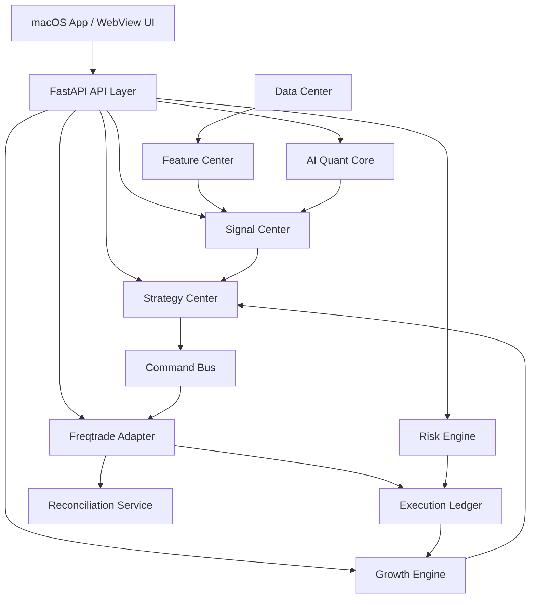

# PulseDesk v2.4 模块边界、事件解耦与 Command Bus 设计

> 目标：避免 PulseDesk 变成模块之间互相直接读写数据库、互相调用内部实现的“大泥球”。v2.4 规定每个模块的职责、输入输出、可写资源和禁止事项。

## 1. 总体模块图



---

## 2. 模块职责

## 2.1 Signal Center

### 职责

```text
接收 Signal
校验 Signal
存储 Signal 索引/详情/证据/ProviderTrace
管理 Signal 生命周期
提供 SignalRepository 统一查询
提供 Signal 聚合与冲突检测
```

### 输入

```text
AI Quant Core 输出
Feature Center 输出
Manual Signal
Strategy / DAG 输出
Manipulation Radar 输出
```

### 输出

```text
SignalView
SignalAggregate
SignalConflictReport
StrategyDraft input
```

### 允许写表

```text
signals
signal_payloads
signal_evidence
signal_provider_traces
signal_lifecycle_events
signal_snapshots
```

### 禁止

```text
禁止创建 TradeIntent。
禁止写 strategy_versions。
禁止调用 Freqtrade。
禁止直接下单。
```

---

## 2.2 Strategy Center

### 职责

```text
管理 Strategy / StrategyVersion 生命周期
把 StrategyDraft 编译为 StrategyRuleDSL
校验 DSL
保存 DSL 版本
生成 Freqtrade 所需 rules JSON 和 config 请求
管理策略工作台与画布编辑模式
```

### 输入

```text
Manual StrategyDraft
AI Research StrategyDraft
RAG StrategyDraft
Signal-to-Strategy Draft
Canvas DSL 编辑结果
Growth Engine CandidateStrategy
```

### 输出

```text
StrategyVersion
StrategyRuleDSL
DeployRulesCommand
StartBacktestCommand
StartDryRunCommand
```

### 允许写表

```text
strategies
strategy_versions
strategy_rule_dsl_versions
strategy_runs
```

### 禁止

```text
禁止直接写 Freqtrade 容器文件。
禁止直接生成开放式 Strategy.py。
禁止直接下单。
禁止绕过 RiskEngine 创建 live_small。
```

---

## 2.3 Freqtrade Adapter

### 职责

```text
管理 Freqtrade Docker 容器
生成 config.json
发布 rules JSON
运行 backtest / dry-run / live_small
连接 Freqtrade REST / WebSocket
同步 orders / trades / positions
将 Freqtrade 事件写入 Execution Ledger
执行 reconciliation
```

### 输入

```text
Command Bus 命令
StrategyRuleDSL 发布包
RiskEngine live_small 许可
```

### 输出

```text
FreqtradeRun
ExecutionLedgerEvent
ReconciliationReport
RunStatus
```

### 允许写表

```text
freqtrade_runs
execution_ledger_events
orders
positions
```

### 禁止

```text
禁止接受 UI 直接 Docker 操作。
禁止接受 AI 直接 Docker 操作。
禁止加载 AI 直接生成的 Strategy.py。
禁止在 reconciliating 状态下发送新交易命令。
```

---

## 2.4 Risk Engine

### 职责

```text
评估 TradeIntent
执行 RiskPolicy
输出 RiskDecision
决定 ALLOW / REDUCE_SIZE / REJECT / PAPER_ONLY / HUMAN_CONFIRM
记录 RiskEvent
```

### 输入

```text
TradeIntent
PortfolioState
FreqtradeRunStatus
ManipulationRisk
SignalConflictReport
ProviderHealth
```

### 输出

```text
RiskDecision
RiskEvent
ExecutionLedgerEvent
```

### 允许写表

```text
risk_decisions
execution_ledger_events
```

### 禁止

```text
禁止直接修改 strategy_versions。
禁止直接操作 Docker。
禁止在 Freqtrade degraded / reconciliating 时允许新 live_small。
```

---

## 2.5 AI Quant Core

### 职责

```text
LLMRouter / ProviderPolicy
TradingAgents Adapter
AI-Trader-style Agent Runtime
RAG
Cloud structured output
Remote TimesFM / Chronos / SHAP Provider
PrivacyRedactor
ProviderTrace
```

### 输出

```text
ResearchReport
Insight
SignalCandidate
StrategyDraft
AttributionReport
```

### 允许写表

默认不直接写业务表，应通过对应服务写：

```text
通过 Signal Center 写 Signal
通过 Strategy Center 提交 StrategyDraft
通过 Growth Engine 写 AttributionReport
```

### 禁止

```text
禁止直接写 strategy_versions。
禁止生成 Strategy.py。
禁止操作 Freqtrade。
禁止直接创建 live_small。
禁止将 API Key / Exchange Secret / 未脱敏订单明细发送到云端 Provider。
```

---

## 2.6 Growth Engine

### 职责

```text
订单归因
盈利/亏损订单挖掘
SHAP 批处理
FeatureSnapshot 分析
生成 CandidateStrategy
自动回测请求
策略进化建议
```

### 输入

```text
ExecutionLedger
Orders
Positions
FeatureSnapshots
TradeIntentSignalSnapshots
RiskDecisions
```

### 输出

```text
GrowthReport
AttributionReport
StrategyCandidate
BacktestRequest
```

### 允许写表

```text
order_attributions
growth_reports
strategy_candidates
```

### 禁止

```text
禁止自动替换 live 策略。
禁止自动提高仓位。
禁止关闭风控。
禁止直接进入 live_small。
```

---

## 3. Event Bus 设计

v2.4 不要求第一阶段引入 Kafka。个人项目可先用 PostgreSQL outbox table + 后台 worker 实现。

### 3.1 outbox_events 表

```sql
CREATE TABLE outbox_events (
    id UUID PRIMARY KEY,
    event_type TEXT NOT NULL,
    aggregate_type TEXT NOT NULL,
    aggregate_id UUID NOT NULL,
    payload JSONB NOT NULL,
    status TEXT NOT NULL DEFAULT 'pending',
    retry_count INTEGER NOT NULL DEFAULT 0,
    created_at TIMESTAMPTZ DEFAULT now(),
    processed_at TIMESTAMPTZ
);
```

### 3.2 核心事件

```text
SignalCreated
SignalExpired
StrategyDraftCreated
StrategyVersionValidated
StrategyRuleDSLPublished
BacktestRequested
BacktestCompleted
DryRunStarted
TradeIntentCreated
RiskDecisionCreated
FreqtradeOrderSynced
FreqtradeRunDegraded
ReconciliationStarted
PositionReconciled
OrderClosed
GrowthAnalysisCompleted
StrategyCandidateCreated
```

---

## 4. Command Bus 设计

### 4.1 command_bus 表

```sql
CREATE TABLE command_bus_commands (
    id UUID PRIMARY KEY,
    command_type TEXT NOT NULL,
    aggregate_type TEXT NOT NULL,
    aggregate_id UUID,
    payload JSONB NOT NULL,
    status TEXT NOT NULL CHECK (status IN ('pending','running','succeeded','failed','cancelled','timeout','retry_waiting')),
    idempotency_key TEXT NOT NULL UNIQUE,
    requested_by TEXT NOT NULL,
    locked_by TEXT,
    locked_at TIMESTAMPTZ,
    retry_count INTEGER NOT NULL DEFAULT 0,
    max_retries INTEGER NOT NULL DEFAULT 3,
    next_retry_at TIMESTAMPTZ,
    priority INTEGER NOT NULL DEFAULT 100,
    timeout_sec INTEGER NOT NULL DEFAULT 300,
    cancel_requested BOOLEAN NOT NULL DEFAULT FALSE,
    correlation_id UUID,
    causation_id UUID,
    error_code TEXT,
    error_message TEXT,
    created_at TIMESTAMPTZ DEFAULT now(),
    started_at TIMESTAMPTZ,
    completed_at TIMESTAMPTZ
);
```

### 4.2 允许的命令

```text
DeployRulesCommand
StartBacktestCommand
StartDryRunCommand
StopDryRunCommand
PauseStrategyCommand
RequestLiveSmallCommand
EmergencyStopCommand
StartReconciliationCommand
```

### 4.3 命令约束

```text
1. 所有 Freqtrade 写操作必须经 Command Bus。
2. Command 必须有 idempotency_key，防止重复点击/重试导致重复启动容器。
3. RequestLiveSmallCommand 必须携带 human_confirmed=true。
4. reconciliating 状态下，只允许 EmergencyStopCommand 和 StartReconciliationCommand。
5. AI Quant Core 不能直接创建 Command，只能创建 StrategyDraft / Signal。
```

---

## 5. 模块间禁止事项总表

| 来源模块 | 禁止行为 | 原因 |
|---|---|---|
| UI | 直接写 DB / Docker | 绕过审计 |
| AI Quant Core | 生成开放式 Strategy.py | 代码注入和语法脆性；只能生成 StrategyDraft / StrategyRuleDSL 草稿 |
| AI Quant Core | 直接创建 live command | AI 不能交易 |
| Canvas | 直接启动 Freqtrade | 画布只是编辑器 |
| Growth Engine | 自动替换实盘策略 | 自我进化必须人工确认 |
| Signal Center | 创建 TradeIntent | Signal 与 Intent 分层 |
| Freqtrade Adapter | 自行决定交易权限 | 需 RiskEngine 和命令授权 |
| Risk Engine | 操作容器 | 风控和执行解耦 |

---

## 6. 开发 AI 约束 Prompt 片段

```text
你正在开发 PulseDesk v2.4。必须遵守模块边界：
1. Signal Center 只管理 Signal，不创建 TradeIntent。
2. Strategy Center 只生成 StrategyRuleDSL，不生成 Strategy.py。
3. Freqtrade Adapter 的所有写操作必须通过 Command Bus。
4. Execution Ledger 只能 append，不能 update/delete。
5. AI Quant Core 不允许直接写 strategy_versions，不允许创建 live command。
6. Growth Engine 只能生成 StrategyCandidate，不能自动替换 live 策略。
7. 任何模块需要 Signal 详情，必须通过 SignalRepository，不允许直接 join signals 热表。
```


---

## v2.5 收口说明

本文件中若仍存在与 `00_MASTER_ARCHITECTURE_DECISION_v2_5.md` 冲突的旧描述，以 v2.5 Master Architecture Decision 为准。特别是：禁止开放式 Strategy.py 生成；禁止 Canvas 生成 Python；Freqtrade 只加载固定 `PulseDeskUniversalStrategy.py` 并读取 StrategyRuleDSL RulePackage。
